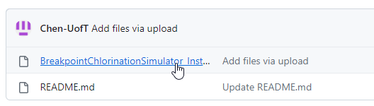
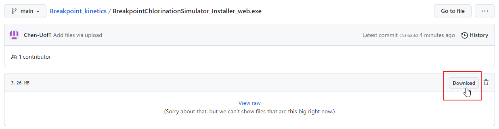
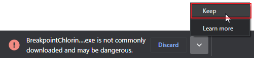
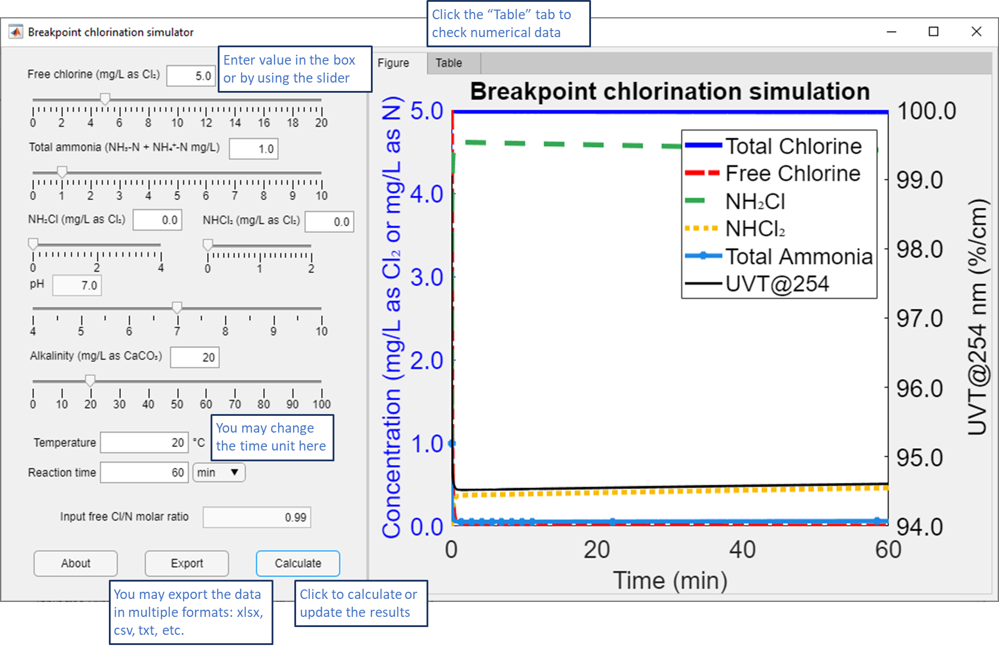

# Breakpoint chlorination kinetics simulator
_current version: July, 2023 size required: 2.4 GB_
## How to install
1. click the installer file 

2. click the "Download" button on the next page to start downloading

3. keep the file despite any warning that your browser might show 

4. Internet connection is needed to install the runtime library for the simulator
## How to use
 
## Validation range
1. This simulator is based on the Unified Plus Model from the PhD thesis: Reactions Between Aqueous Chlorine and Ammonia: A Predictive Model, Xin Huang, Northeastern University, MA (2008)

2. The Unified Plus Model by Huang (2008) was calibrated and validated within the range: pH 6.5-9.5, temperature 4-30°C, total carbonate buffer 9×10⁻⁴ - 1×10⁻² M, initial Cl/N molar ratio 0.5-2.0

3. The validation range was extended to pH 5.5 with reaction time < 3 min and 60 min, temperature 4 and 20°C and Cl/N molar ratio 0.5–11. The validated parameters are applied to 5.0 < pH < 6.0 and 2 < T < 6 (for 4°C validation) 15 < T < 25°C (for 20°C validation) in this simulator.

4. The trichloramine concentration was not validated.

## Reference
Reactions Between Aqueous Chlorine and Ammonia: A Predictive Model, Xin Huang, Northeastern University, MA (2008) 
Tianyi Chen, Erin Mackey, Susan Andrews, Ron Hofmann. (2023) Kinetics of chlorine and chloramine reactions in reverse osmosis permeate and their impact on radical formation during UV advanced oxidation for water reuse
## Questions?
Contact me at tianyichen626@gmail.com
